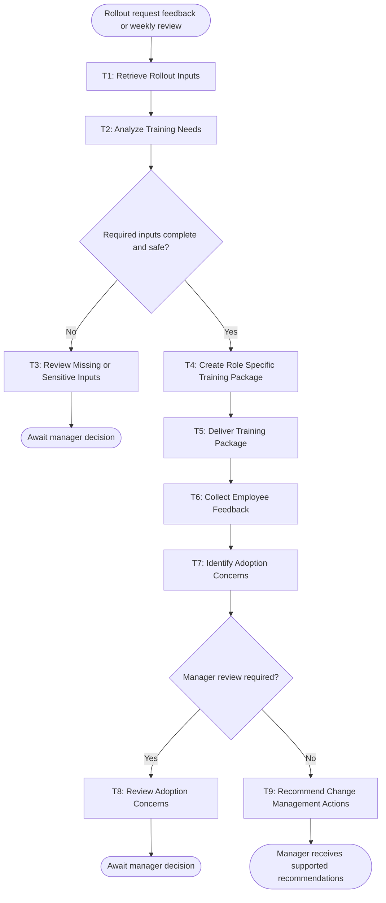

# SLO ChangeBridge Workflow

## 1. Workflow Goal

This workflow supports the goal in the completed [team charter](https://github.com/Warren-Creates/BUS4498_Team_Build#team-charter): help a local San Luis Obispo cafe implement its online-ordering and point-of-sale system through role-specific training, employee feedback, adoption-concern identification, and timely change-management recommendations.

## 2. Workflow Trigger

A cafe manager submits a rollout-support request, new employee feedback becomes available, or the weekly adoption-review schedule begins a workflow run.

## 3. Completion Condition at Runtime

A run is complete when the manager receives a role-specific training package and/or a documented set of adoption concerns and recommended actions, with the supporting inputs and any required human decisions recorded. A case that requires human review is complete only when it is explicitly assigned to the manager or designated reviewer.

## 4. General Workflow

The workflow retrieves approved rollout materials, role information, training records, and feedback; then it assesses what each role needs to use the new system confidently. It creates a role-specific training package, shares it through the approved internal channel, collects structured feedback, and identifies adoption concerns. The system then recommends change-management actions based on the priority and evidence for each concern.

Missing rollout details, sensitive employee information, contradictory feedback, tool failures, and recommendations that affect staffing, policy, or customer commitments are routed to the cafe manager for review. The manager receives the evidence, unresolved question, and proposed next action. The workflow stops for review and resumes only when the manager supplies the missing information or decision.

## 5. Workflow Diagram

